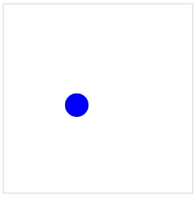

<div align="center">
  

# School of Electronic Engineering and Computer  Science

## ECS521U - INTERACTIVE MEDIA DESIGN AND PRODUCTION<br>Lab 1
</div>


### About this Lab
This lab includes basis of Canvas, SVG, Interaction and Animations.

Make sure to disable the browser cache to avoid issues with caching the JavaScript and CSS files. (e.g. In Google Chrome, open the development tools using  `Ctrl + Shift + i`, then click settings and tick "Disable cache (while DevTools is open)").

### A. Canvas and JavaScript

1. Open [html/canvas.html](https://github.com/giussepi/ECS521-Interactive-Media-Design-and-Production-Labs-Work-2022-Lab-1/blob/main/html/canvas.html) file in your web browser (chrome/firefox/ie).
2. Open the `html/canvas.html` file with your text editor.

#### Drawing in Canvas (step-by-step) with JavaScript
Tip: The below source code will be inserted between "<script></script>" element. We will be studying JavaScript in next lecture.

1. Find the canvas element.
    ``` js
    var canvas = document.getElementById("myCanvas");
    ```
2. Create a drawing object.
    ``` js
    var ctx = canvas.getContext("2d");
	```
3. Draw in the canvas. <br/>
   ```js
   ctx.fillStyle = "#FF0000";
   ctx.fillRect(25, 25, 50, 50);
   ```

#### Practice Examples

1. Draw a [straight line](https://www.w3schools.com/graphics/canvas_coordinates.asp) on a canvas, use the following methods:
   * **moveTo(x,y)** - defines the starting point of the line
   * **lineTo(x,y)** - defines the ending point of the line
	 To actually draw the line, you must use one of the "ink" methods, like stroke().

2. Draw a [circle](https://www.w3schools.com/graphics/canvas_coordinates.asp) on a canvas, use the following methods:
    * **beginPath()** - begins a path
    * **arc(x,y,r,startangle,endangle)** - creates an arc/curve. To create a circle with `arc()`: Set start angle to 0 and end angle to `2*Math.PI`. The x and y parameters define the x- and y-coordinates of the center of the circle. The r parameter defines the radius of the circle.
   Define a circle with the `arc()` method. Then use the `stroke()` method to actually draw the circle.

3. Draw [text](https://www.w3schools.com/graphics/canvas_text.asp) on a canvas, the most important property and methods are:
    * **font** - defines the font properties for the text
    * **fillText(text,x,y)** - draws "filled" text on the canvas
    * **strokeText(text,x,y)** - draws text on the canvas (no fill)

4. Draw an [image](https://www.w3schools.com/graphics/canvas_images.asp) on a canvas as follows:
   1. Include the image `pic_the_scream.jpg`, from the `imgs` folder, in `html/canvas.html` using html but do not display it. Remember to fix image width and height.
	  ``` html
	  
	  ```
   2. Select it using JavaScript
	  ``` js
	  var img = document.getElementById("scream");
	  ```
   3. Draw the image
      ``` js
	  ctx.drawImage(img, 10, 10);
	  ```

5. Draw [Paths](https://www.w3schools.com/tags/ref_canvas.asp) on canvas like this using following script and see the output:
    ``` js
    ctx.beginPath();
    ctx.arc(75,75,50,0,Math.PI*2,true);  // Outer circle

    ctx.moveTo(110,75);
    ctx.arc(75,75,35,0,Math.PI,false);   // Mouth

    ctx.moveTo(65,65);
    ctx.arc(60,65,5,0,Math.PI*2,true);  // Left eye

    ctx.moveTo(95,65);
    ctx.arc(90,65,5,0,Math.PI*2,true);  // Right eye

    ctx.stroke();
    ```
### B. SVG and JavaScript

1. Open [html/svg.html](https://github.com/giussepi/ECS521-Interactive-Media-Design-and-Production-Labs-Work-2022-Lab-1/blob/main/html/svg.html) in browser (chrome/firefox/ie).
2. Open `html/svg.html` with your text editor.

#### Practice Examples

1. **Draw Ellipse** using following [link](https://www.w3schools.com/graphics/svg_ellipse.asp)
2. **Draw Polygon** using following [link](https://www.w3schools.com/graphics/svg_polygon.asp)
3. **Write a text** using following [link](https://www.w3schools.com/graphics/svg_text.asp)

### C. To Do Questions

1. Open [html/ToDo.html](https://github.com/giussepi/ECS521-Interactive-Media-Design-and-Production-Labs-Work-2022-Lab-1/blob/main/html/ToDo.html) the file in your web browser (chrome/firefox/ie).
2. Open `js/ball.js` with your text editor.

#### Canvas and JavaScript

_Animation_
1. Examine the canvas and the definition of the ball object.
2. Replace `ball.draw()`; by the following code:
   ``` js
    function drawBall(){
      ball.x += ball.vx;
      ball.y += ball.vy;
      ball.draw();
      window.requestAnimationFrame(drawBall);
    }
    drawBall();
   ```

**_Questions:_**
1. Make the ball move only on horizontal direction.
2. Make the ball move only on vertical direction.
3. keep the ball moving inside the canvas.
   _Hints_:
   1. Use `if` conditions to check `ball.x` and `ball.y` values.
   2. Update `ball.x` and `ball.y` values  based on the ball direction (e.g. right, down, left, up)

   

#### SVG and JavaScript

1. Open `html/ToDo.html` with your text editor.
2. Go to [SVG Editor](https://svgedit.netlify.app/editor/index.html).
3. Draw a stick figure.
4. Click on `<svg>` button (top toolbar) and copy-paste the SVG of your drawing
   to the place marked in the `html/Todo.html` file. Save changes and refresh your
   browser.

**Notes**:
1. Examine the JavaScript code at `js/stick.js`. It connects two functions to mouse-events, in relation to an SVG object called `stick_figure`.
2. Add the `id` attribute to the `<svg>` tag, so that it reads `id="stick_figure"`. Reload the page.
3. Try moving the mouse over your drawing.
4. Add the properties `x=0 y=0` to `<svg>` tag. Reload the page.
5. Examine the listener keydown and the function move. Go to the browser and press the right arrow key. Check the console to see the correct key code. Do the same for the left arrow key. Replace the key codes in the move function.

**_Questions:_**
1. Move the stick figure by using the right, left arrow keys.
2. Move figure up and down using respective arrow keys.


## Submission Instructions:
### Deadline: 7/10/22 17:00
The Submission Link is available under ASSESMENT INFORMATION Section of Module Page.

### General Instruction:
- Assignments must be submitted in a .zip package or alike ( .7z .bdoc .cdoc .ddoc .gtar .tgz .gz .gzip .hqx .rar .sit .tar .zip). Code submitted in other formats will not be accepted. Corrupt or otherwise unreadable files will not be accepted.
- Make sure to compress/zip the whole folder `ECS521-Interactive-Media-Design-and-Production-Labs-Work-2022-Lab-1-main` so all your work is included in the submission.
- Rename the compressed/zipped folder using your full name e.g.: `Giussepi Lopez.zip`

### Submission Checklist
- [x] Has your file been saved in a zip package?
- [x] Have you clicked [Submit] after uploading?
- [x] Have you checked that the file you uploaded is the correct version?
- [x] The first time you submit, you will be required to accept the Turnitin End User Licence Agreement.
- [x] After uploading, it is your responsibility to check that your file is in the correct format and that it is readable.

Late submissions will receive late penalties in line with the late penalty policy, see EECS handbook and QMUL assessment handbook.

### Specific Instructions:
1. Total No. of Questions: 05 (Canvas and JavaScript: 03 + SVG and JavaScript: 02)
2. To get half marks in Canvas and JavaScript section, your code should be fully functional for at least Question No. 1 and 2.
3. To get half marks in SVG and JavaScript section, your code should be fully functional for at least moving in right and left direction.

## Good Luck!
